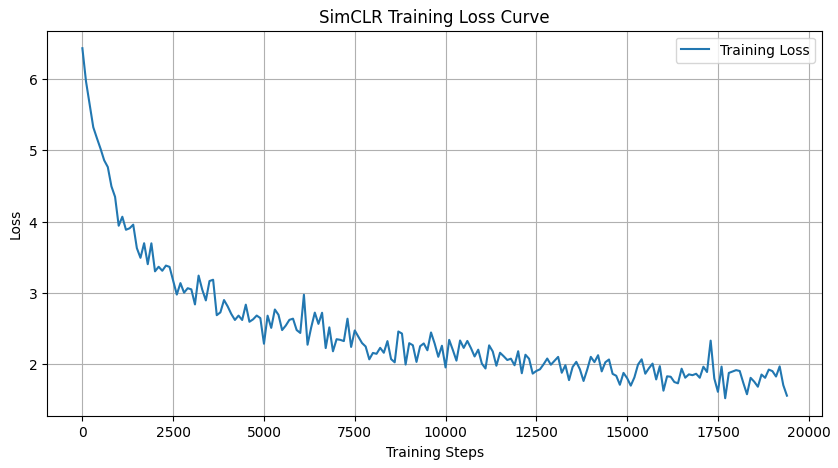

# Tugas Eksperimen Self-Supervised Learning dengan SimCLR

Folder ini berisi file-file tugas untuk mata kuliah Machine Learning, dengan fokus pada implementasi dan analisis metode *Self-Supervised Learning* (SSL) menggunakan arsitektur **SimCLR**.

Tujuan dari tugas ini adalah untuk memahami komponen utama SimCLR, melakukan modifikasi pada arsitektur atau pipeline data, dan menganalisis dampaknya terhadap proses pelatihan model.

---

### **Modifikasi yang Dilakukan**

Eksperimen ini mencakup dua modifikasi utama dari kode dasar yang diberikan:

1.  **Penambahan Augmentasi Data**: Transformasi `RandomSolarize` ditambahkan ke dalam pipeline augmentasi untuk meningkatkan variasi data dan menguji robustisitas model terhadap transformasi non-linear.
2.  **Perampingan *Projection Head***: Arsitektur *projection head* diubah menjadi lebih ramping (`[512 -> 256 -> 128]`) untuk menguji apakah model dengan kapasitas yang lebih efisien tetap mampu mempelajari representasi fitur yang berkualitas.

---

### **Hasil Pelatihan**

Model dilatih selama 50 *epoch* pada dataset **Tiny ImageNet**. Proses pelatihan menunjukkan konvergensi yang baik, yang dapat dilihat dari kurva *loss* di bawah ini. Hasil akhir menunjukkan model berhasil mempelajari representasi yang diskriminatif.

---

### **Isi Repositori**

* `SimCLR_Modified_Ghulam.ipynb`: Notebook utama berisi implementasi kode, modifikasi, dan hasil pelatihan.
* `442023611060_GhulamMushthofa.pdf`: Laporan akhir penelitian dalam format IEEE yang merangkum metodologi, hasil, dan analisis.
* `grafik_training_loss.png`: Gambar kurva *training loss* yang dihasilkan selama pelatihan.